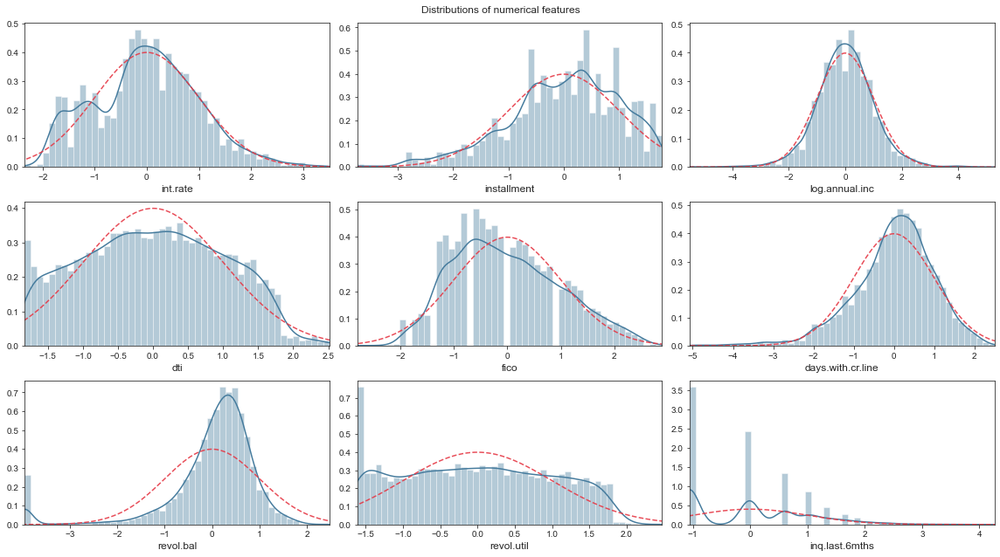

# A-Deep-Dive-into-Imbalanced-Loan-Data-from-lendingclub.com

The dataset contains 9578 observations and 12 features. 

## Train test split 

The dataset is splited into 80% training set (containing validation set) and 20% test set using stratified sampling. 

## Exploratory Data Analysis 

- Target variable 


- Numerical Feature 
	- skewness 
	- different scale 


- Categorical Feature 


## Feature Engineering 



## Feature Selection 

- Mutual Information 
- Recursive Feature Elimination 

## Dimensionality Reduction 

- Principle Component Analysis (PCA)

## Sampling

- SMOTE

## Models 

- Dummy classifier ()
- Logistic Regression 
- Weighted Logistic Regression 
- Decision Trees
- Random Forest
- XGBoost

## Evaluation Metrics 

- Recall 
- F1, F2, and F4 scores 

## Hyperparameter Tuning

- Randomized Search Cross-Validation 
- Grid Search Cross-Validation 

## Final Model Performanceo

```
============================================================
Model evaluation using K fold stratification
<<<   XGBClassifier(base_score=0.5, booster='dart', colsample_bylevel=1,
              colsample_bynode=1, colsample_bytree=1, enable_categorical=False,
              eta=0.1, gamma=0, gpu_id=-1, importance_type=None,
              interaction_constraints='', learning_rate=0.100000001,
              max_delta_step=0, max_depth=4, min_child_weight=1, missing=nan,
              monotone_constraints='()', n_estimators=200, n_jobs=-1,
              num_parallel_tree=1, predictor='auto', random_state=42,
              reg_alpha=0, reg_lambda=6, scale_pos_weight=1, subsample=0.8,
              tree_method='exact', validate_parameters=1, verbosity=None)   >>>
------------------------------------------------------------
mean recall scores, train: 0.8394, test: 0.8041
mean F1 scores, train: 0.8899, test: 0.8507
mean F2 scores, train: 0.8589, test: 0.8221
mean F4 scores, train: 0.8451, test: 0.8093
mean accuracy scores, train: 0.8962, test: 0.8589
============================================================
```


